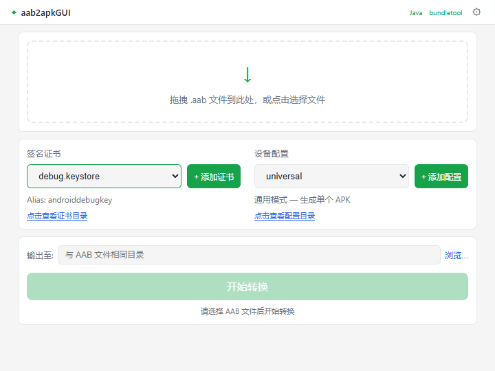

# aab2apkGUI

将 Android App Bundle (`.aab`) 转换为可安装的 APK 文件的跨平台桌面工具。



## 快速上手

### 第一步：下载安装

从 [Releases](../../releases) 页面下载最新版本的安装包：

- **Windows**：下载 `aab2apkGUI_x.x.x_x64-setup.exe`，双击安装
- **macOS**：下载 `aab2apkGUI_x.x.x_x64.dmg`，拖入 Applications 文件夹

### 第二步：安装依赖工具

软件运行需要两个外部工具：

1. **JDK 11+**：[下载 Adoptium OpenJDK](https://adoptium.net/download/)，安装后确保 `java` 已加入系统 PATH（打开终端输入 `java --version` 验证）
2. **bundletool.jar**：[下载最新版](https://github.com/google/bundletool/releases)，保存到本地任意目录

### 第三步：配置并转换

1. 启动 aab2apkGUI
2. 点击右上角 ⚙ 图标打开设置，选择你下载的 `bundletool.jar` 路径，保存
3. 将 `.aab` 文件拖入窗口（或点击选择）
4. 选择签名证书（默认已提供 debug 证书，开箱即用）
5. 点击 **开始转换**，等待完成
6. 点击生成的 APK 文件名即可打开所在目录

## 功能

- **拖拽或选择 .aab 文件**，自动读取基本信息并设置输出目录
- **证书本地管理**：下拉选择签名证书，支持添加自定义证书
- **设备配置管理**：预设多款设备模板，支持自定义 JSON 配置
- **转换进度实时显示**，日志可折叠展开
- **输出目录可选**，默认与 AAB 文件同目录
- **启动环境检测**：自动检测 Java 和 bundletool，缺失时引导下载

## 前置要求

| 依赖 | 说明 |
|------|------|
| [JDK 11+](https://adoptium.net/download/) | 安装后请确保 `java` 已加入系统 PATH |
| [bundletool.jar](https://github.com/google/bundletool/releases) | 在应用的设置弹窗中配置路径 |

## 安装

从 [Releases](../../releases) 下载对应平台的安装包：

| 平台 | 安装包 |
|------|--------|
| Windows | `.msi` 或 `.exe` |
| macOS | `.dmg` |
| Linux | `.deb` 或 `.AppImage` |

## 构建

### 环境准备

1. **Node.js 20+** — 前端构建
2. **Rust 工具链** — 后端编译
   ```bash
   # Windows
   curl --proto '=https' --tlsv1.2 -sSf https://sh.rustup.rs | sh
   # 或下载安装包 https://rustup.rs/
   ```
3. **系统依赖**（Tauri 要求）

   | 平台 | 依赖 |
   |------|------|
   | Windows | WebView2（Win10+ 已内置）；MSVC 目标需 [VS Build Tools](https://visualstudio.microsoft.com/visual-cpp-build-tools/)，GNU 目标需 [MinGW-w64](https://www.mingw-w64.org/) |
   | macOS | Xcode Command Line Tools：`xcode-select --install` |
   | Linux | `sudo apt install libwebkit2gtk-4.1-dev libgtk-3-dev` |

### 构建步骤

```bash
# 1. 克隆仓库
git clone https://github.com/<user>/aab2apkGUI.git
cd aab2apkGUI

# 2. 安装前端依赖
npm install

# 3. 开发运行（热重载）
npx tauri dev

# 4. 生产构建
npx tauri build
```

### 构建产物位置

| 平台 | 路径 |
|------|------|
| Windows | `src-tauri/target/release/bundle/nsis/` (`.exe`) `msi/` (`.msi`) |
| macOS | `src-tauri/target/release/bundle/dmg/` (`.dmg`) |
| Linux | `src-tauri/target/release/bundle/deb/` (`.deb`) `appimage/` (`.AppImage`) |

### CI 构建

推送带 `v` 前缀的 tag 自动触发 GitHub Actions 构建并发布 Release：

```bash
git tag v0.1.0
git push origin v0.1.0
```

也可在 Actions 页面手动触发（`workflow_dispatch`）。

## 技术栈

- [Tauri v2](https://v2.tauri.app/) — 跨平台桌面框架
- [Vue 3](https://vuejs.org/) + TypeScript — 前端 UI
- [Rust](https://www.rust-lang.org/) — 后端命令逻辑
- [bundletool](https://github.com/google/bundletool) — Google 官方 AAB 转换工具

## 许可

MIT
